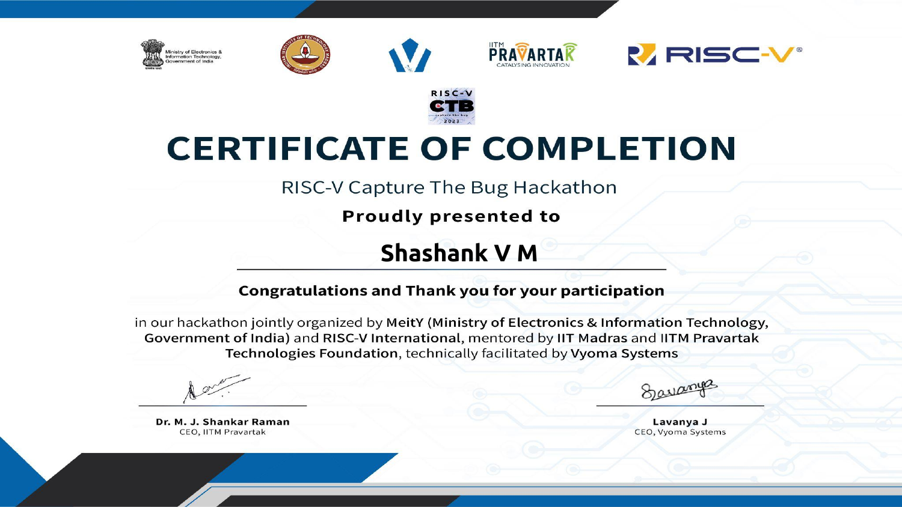

# RISC-V Processor Verification Challenges

Hands-on RISC-V verification exercises focused on instruction generation, directed assembly tests, exception handling, and differential simulation. The repository documents debugging work across RV32I-oriented challenges and includes a bundled reference-versus-DUT simulation flow.

> **Scope:** This is a verification and test-development project. It does not contain editable processor RTL; Level 3 runs a supplied `riscv_buggy` simulator executable.

## Verification work

| Area | Verification problem | Work documented |
| --- | --- | --- |
| Level 1: generator and assembly tests | Random-test configuration included instructions outside the intended RV32I scope; generated assembly also contained invalid operands; one test did not terminate. | Disabled the unwanted RV64M distribution, corrected invalid register/immediate operands, and added a bounded loop exit. |
| Level 2: instruction and exception tests | Random instruction generation needed an RV32I configuration; illegal-instruction handling could return to the faulting instruction and retrap. | Added generator configuration and illegal-instruction stimulus, then changed the exception path to terminate instead of re-executing the illegal instruction. |
| Level 3: differential simulation | Compare the supplied processor model's trace with a Spike reference run. | Includes directed and AAPG-generated random tests, trace comparison, and saved RISCV-DV coverage artifacts. |

The fixes and challenge-specific context are documented in the READMEs under each level. The `tutorial/` directory contains smaller directed, AAPG, and RISCV-DV examples.

## Recognition

**RISC-V Capture The Bug Hackathon — Certificate of Completion**

[](assets/riscv-ctb-participation-certificate.pdf)

*The certificate preview is shown above. [Open or download the full PDF](assets/riscv-ctb-participation-certificate.pdf).*

## Debugging evidence

The repository includes before-and-after screenshots for the documented fixes, plus trace-comparison evidence. Expand a section to view the screenshots.

<details>
<summary>Constraining random generation to RV32I</summary>
<p>


</p>
</details>

<details>
<summary>Bounding the directed loop test</summary>
<p>


</p>
</details>

<details>
<summary>Correcting invalid generated assembly operands</summary>
<p>


</p>
</details>

<details>
<summary>Preventing repeated illegal-instruction traps</summary>
<p>


</p>
</details>

<details>
<summary>Comparing reference and DUT traces</summary>
<p>

</p>
</details>

## Repository map

```text
challenge_level1/
  challenge1_logical/       Generated assembly operand fixes
  challenge2_loop/          Bounded loop test
  challenge3_illegal/       Illegal-instruction exception handling
challenge_level2/
  challenge1_instructions/  RV32I random instruction test
  challenge2_exceptions/    Illegal-instruction exception test
challenge_level3/
  directed_test/            Directed assembly and DUT-vs-Spike comparison
  random_test/              AAPG generation and DUT-vs-Spike comparison
  riscv_dv_coverage/        Coverage inputs, report, and bug evidence
tutorial/
  directed/                 Directed assembly and Spike examples
  aapg_random/              AAPG random-test example
  riscv_dv_random/          RISCV-DV test list
```

## Running the simulations

The Makefiles are intended to be run from their respective test directories. For example:

```bash
cd challenge_level3/directed_test
make
```

The Level 3 random flow can be run with:

```bash
cd challenge_level3/random_test
make
```

These Level 3 flows compile assembly, produce a Spike reference trace, run the bundled `riscv_buggy` executable, and compare the resulting traces. The random flow also generates its assembly using AAPG.

### Tool requirements

- GNU Make and a RISC-V GNU toolchain providing `riscv32-unknown-elf-gcc` and `riscv32-unknown-elf-objdump`
- Spike RISC-V ISA simulator
- `elf2hex` for the Level 3 DUT flows
- AAPG for random-test generation; Python/pip are needed to install or run it
- RISCV-DV and its Python dependencies for the documented RISCV-DV flow

Some Makefiles use fixed paths such as `/tools/mod_spike/bin/spike`, while others expect Spike on `PATH`. `setup.sh` and `model_setup.sh` also refer to tools under `/tools`; they are environment-specific rather than portable installers. The Dev Container references a prebuilt image tagged `2.0.0`; there is no separate tool-version manifest or dependency lockfile. Use an environment containing the required tools and paths before running the flows.

To generate the documented RISCV-DV test from its test directory:

```bash
cd challenge_level3/riscv_dv_coverage
run --target rv32i --test riscv_arithmetic_basic_test \
  --testlist testlist.yaml --simulator pyflow
```

## Coverage status

The checked-in report, `challenge_level3/riscv_dv_coverage/cov_out_2023-07-31/CoverageReport.txt`, contains 147 covergroups across multiple extensions. It does **not** demonstrate 100% RV32I coverage. The 27 RV32I-related covergroups identified in the project notes have an unweighted arithmetic mean of **32.34%**; this is a derived summary, not a single RV32I score reported by the coverage tool. Groups for other extensions are excluded from that calculation.

## Skills exercised

- RISC-V assembly test development and ISA-focused test configuration
- Directed and constrained-random test generation
- Exception-path and test-termination debugging
- Instruction-set simulator (ISS) reference checking
- Differential trace analysis and functional-coverage interpretation
